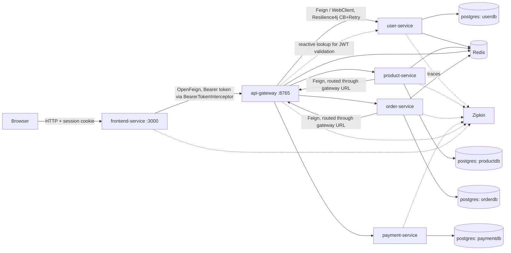
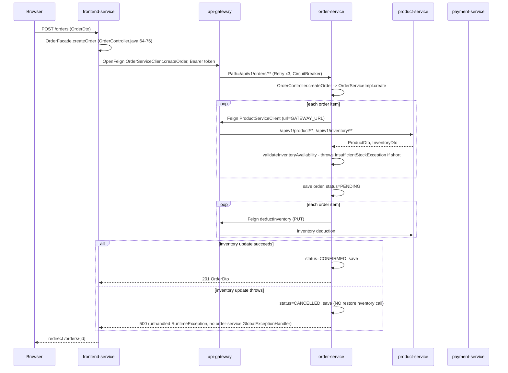

# Architecture

System topology and runtime behavior, derived from code and config (not from `README.md`,
which contains inaccuracies — see "README discrepancies" at the end).

> **Amendment (GH #17/#18/#19 fix):** this doc predates the fix for three P0 security
> issues. Previously, only `api-gateway` validated JWTs; a caller with direct network
> reach to any backend service pod bypassed authentication entirely, and every
> ownership check (`UserServiceImpl`, `AddressServiceImpl`) trusted the gateway-set,
> spoofable `X-User-ID` header, while `RoleController.create`/`delete` had no
> authorization check at all. Fix: `user-service`, `product-service`, `order-service`,
> and `payment-service` each now run their own `JwtAuthFilter` + `JwtService`
> (`infrastructure/security/` or `infastructure/security/` for product-service),
> independently validating the bearer token's signature/expiry against the same
> shared HMAC secret (`constants/JwtConstants`, now present in all four modules) and
> overwriting `X-User-ID`/`X-User-Name`/`X-User-Role` on the request with values
> derived from the token's verified claims. Tokens issued by `user-service`'s
> `login()` now carry `userId` and `role` claims (previously subject/username only).
> Service-to-service Feign calls (order-service -> product/payment/user-service,
> payment-service -> order-service, product-service -> user-service) now carry the
> caller's bearer token via a new `IncomingAuthHeaderFeignInterceptor` in each of
> those three modules, since the callee now requires one. `api-gateway`'s
> `JwtAuthFilter` also now reads the token's `role` claim and propagates it as
> `X-User-Role` downstream (previously discarded). `RoleController.create`/`delete`
> now require the verified `X-User-Role` header to equal `ADMIN`
> (`user-service/domain/enums/UserRole`). Basic Kubernetes `NetworkPolicy` manifests
> were added under `k8s/services/<service>/` restricting ingress on each backend
> service's port to `api-gateway` and the other backend services only. Per-service
> ai_docs have brief amendment notes but have not been fully regenerated; the
> per-endpoint auth tables and "no auth in this module" gotchas below are stale.

## Services

| Service | Role | Port (container) | Framework |
|---|---|---|---|
| `api-gateway` | Reactive edge router. JWT validation, circuit breaking, retry, fallback. | 8765 | Spring Cloud Gateway (WebFlux) |
| `user-service` | Users, accounts, addresses, roles. JWT issuance. | 8080 | Spring Boot MVC |
| `product-service` | Products, variations, categories, inventory, reviews. | 8080 | Spring Boot MVC |
| `order-service` | Carts, orders, order items, discounts. | 8080 | Spring Boot MVC |
| `payment-service` | Payment records, simulated gateway. | 8080 | Spring Boot MVC |
| `frontend-service` | Server-rendered web client. | 3000 | Spring Boot MVC + Thymeleaf + HTMX |

All five backend services and the gateway run on internal port 8080/8765; `frontend-service`
is the only service on 3000. Confirmed from each `application.yml` `server.port` and each
Dockerfile `EXPOSE`.

## Service dependency graph

Notes on the arrows:
- `frontend-service` never calls a backend service directly. Every `@FeignClient` in
  `frontend-service/src/main/java/.../client/` is either bare (`@FeignClient(name = "...")`,
  resolved through Eureka-style service discovery which is disabled — see Gotchas) or
  explicitly pinned with `url = "${api.gateway.base-url}/..."`
  (`frontend-service/src/main/java/com/kawashreh/ecommerce/frontend/client/PaymentServiceClient.java:18`).
  `BearerTokenInterceptor`
  (`frontend-service/src/main/java/com/kawashreh/ecommerce/frontend/config/BearerTokenInterceptor.java`)
  attaches the session-stored JWT to every outbound Feign call.
- `order-service` and `product-service` call **other** services (`user-service`,
  `product-service`, `payment-service`) through Feign clients configured with
  `url: ${GATEWAY_URL:http://api-gateway:8765}` — i.e. service-to-service calls also transit
  the gateway, not direct pod-to-pod DNS as `CLAUDE.md` states. See
  `order-service/src/main/resources/application.yml:23-31` and
  `product-service/src/main/resources/application.yml:28-32`. The only genuinely direct,
  non-gateway service call is `api-gateway -> user-service` inside `JwtAuthFilter`, via
  `ReactiveUserServiceClient`.
- `docker-compose.yaml` (unified) additionally points `api-gateway`'s own gateway routes
  (`USER_SERVICE_URL`, etc.) at each service's Kubernetes-style DNS name directly
  (`http://user-service:8080`), which is correct — the gateway is the one hop that talks to
  services by DNS name; everything upstream of it goes through the gateway's public routes.

## Auth flow

1. **Login** — `POST /api/v1/user/login` on `user-service`
   (`user-service/src/main/java/.../application/controller/UserController.java:66-73`) calls
   `UserService.login(username, password)`, which (per `Argon2PasswordHasher` in
   `user-service/src/main/java/.../infrastructure/security/Argon2PasswordHasher.java`) verifies
   the password with Argon2, then issues a JWT via `JwtService.generateToken`
   (`user-service/src/main/java/.../infrastructure/security/JwtService.java:22-35`). Token
   is signed HS256 with the constant in
   `user-service/src/main/java/.../constants/JwtConstants.java:7`, 30-minute expiry.
2. **Gateway validation** — every request through `api-gateway` passes through
   `JwtAuthFilter` (`api-gateway/src/main/java/.../Infrastructure/filter/JwtAuthFilter.java`).
   Public paths (`/api/v1/user/register`, `/api/v1/user/login`, `/actuator/health`,
   `/actuator/info`, `/actuator/metrics`) skip auth (line 79-85). All other requests must
   present `Authorization: Bearer <token>`. The filter:
   - extracts the username from the token (`JwtService.extractUsername`, no signature
     verification failure handling beyond the outer `onErrorResume`),
   - calls `user-service` over HTTP (`ReactiveUserServiceClient.retrieveByUsername`) to fetch
     the current user record,
   - calls `JwtService.validateToken(token, userDetails)`, which compares the token's subject
     to the fetched username and checks expiry — it does **not** compare a token hash or
     revocation state, so a token remains valid for its full 30-minute lifetime even after a
     password change,
   - on success, mutates the exchange to add `X-User-Name` and `X-User-ID` headers
     (line 57-60) before forwarding downstream. This is the identity propagation mechanism —
     downstream services trust these headers without re-verifying the JWT themselves (e.g.
     `UserController.update`/`delete` read `X-User-ID` directly, see
     `user-service/src/main/java/.../application/controller/UserController.java:78,89`).
   - `api-gateway/src/main/java/.../Infrastructure/configuration/SecurityConfig.java` is a
     second, overlapping auth layer (Spring Security `authorizeExchange`) with the same
     public-path list, enforced ahead of `JwtAuthFilter` in the filter chain.
3. **Frontend session** — `frontend-service` does not validate JWTs itself for gateway calls;
   it stores the token from `user-service`'s login response in a server-side session via
   `SessionManager` and replays it as a Bearer token on every Feign call
   (`BearerTokenInterceptor`). `frontend-service` used to also declare a `jwt.secret`/
   `jwt.expiration` in `application.yml`, duplicating the gateway/user-service secret, but
   no code in `frontend-service/src/main/java` was found parsing or verifying JWTs locally
   — that dead/vestigial config has since been removed (see `frontend-service.md` Gotchas).

## Order placement flow

The wiring exists end-to-end for `frontend -> gateway -> order-service -> product-service`,
and separately for `frontend -> gateway -> payment-service`, but **the two are never chained
in the same request** — see the gap below.

Payment is a structurally separate path: `frontend-service`'s `PaymentServiceClient`
(`frontend-service/src/main/java/.../client/PaymentServiceClient.java`) and
`order-service`'s `PaymentClient`
(`order-service/src/main/java/.../infrastructure/http/client/PaymentClient.java`) both exist
and are Feign-wired, but **neither is invoked from the order-creation path**:
- `OrderServiceImpl.create` / `createOrderFromCart`
  (`order-service/src/main/java/.../domain/service/impl/OrderServiceImpl.java:37-60,220-247`)
  never references `PaymentClient`. It is injected nowhere and unused in the whole module
  (confirmed by grep — the only reference to `PaymentClient` in `order-service/src` is its
  own interface file).
- `frontend-service`'s `OrderController.createOrder`
  (`frontend-service/src/main/java/.../controller/OrderController.java:64-76`) calls only
  `OrderFacade.createOrder`, which calls only `OrderServiceClient.createOrder`
  (`frontend-service/src/main/java/.../facade/OrderFacade.java:66-72`). No code path calls
  `PaymentServiceClient.processPayment` (confirmed by grep — the only caller of
  `processPayment` outside `payment-service` itself is the unused client interface).

**Compensating transaction, as implemented**: on inventory-update failure, `order-service`
only flips the order's own status to `CANCELLED`
(`OrderServiceImpl.java:54-59,240-246`). It does **not** call
`ProductServiceClient.restoreInventory` to release stock already deducted earlier in the same
loop — `restoreInventory` exists on the Feign interface
(`order-service/src/main/java/.../infrastructure/http/client/ProductServiceClient.java:33-36`)
but has zero callers anywhere in the codebase. If `deductInventory` succeeds for item 1 and
then fails for item 2 (or the subsequent `retrieveProduct` logging call throws), item 1's
stock is deducted permanently even though the order is cancelled. This is a real compensating-
transaction gap, not a documented design choice — there is no comment or test asserting this
behavior is intentional.

## Data ownership

One Postgres logical database per service (see `infrastructure.md` for how the two compose
files instantiate this differently). JPA `ddl-auto: update` in every service — no migration
tool (Flyway/Liquibase) is used; schema is derived from entity annotations at boot.

| Database | Owning service | Entities (`dataAccess/entity`) |
|---|---|---|
| `userdb` | `user-service` | `UserEntity`, `AccountEntity`, `AddressEntity`, `RoleEntity` |
| `productdb` | `product-service` | `ProductEntity`, `ProductVariationEntity`, `CategoryEntity`, `AttributeEntity`, `InventoryEntity`, `ProductReviewEntity` |
| `orderdb` | `order-service` | `OrderEntity`, `OrderItemEntity`, `CartEntity`, `CartItemEntity`, `DiscountEntity` |
| `paymentdb` | `payment-service` | `PaymentEntity` |

No service reads another service's tables directly — all cross-service data access is over
HTTP (Feign), consistent with the layering. `api-gateway` and `frontend-service` own no
database; they use Redis only (gateway: rate-limit/cache infra per `CacheConfig`; user/product
services: response caching per `CacheConstants`).

## Resilience patterns (actual configured values)

**`api-gateway`**, default profile (`api-gateway/src/main/resources/application.yml`):
- Every gateway route (`user-service`, `product-service`, `order-service`,
  `order-cart-service`, `user-role-service`, `user-address-service`, `payment-service`)
  carries a `Retry` filter (3 attempts, `GET,POST`) and a `CircuitBreaker` filter with
  `fallbackUri: forward:/fallback` (`api-gateway/src/main/java/.../FallbackController.java`
  returns 503 plain text). A trailing `frontend-service` catch-all route
  (`Path=/**` → `http://frontend-service:3000`, no filters) forwards everything else — needed
  because the k8s Ingress sends `/` in its entirety to `api-gateway` with no separate
  frontend Ingress rule, and the k8s Deployment runs this default profile.
- **(GH #52 fix)** `resilience4j.circuitbreaker.configs.default`: `slidingWindowSize: 10`,
  `failureRateThreshold: 50`, `slowCallRateThreshold: 50`,
  `waitDurationInOpenState: 10000`ms, `slowCallDurationThreshold: 2000`ms,
  `permittedNumberOfCallsInHalfOpenState: 3`, `minimumNumberOfCalls: 5`. Explicit instances
  now include `order-service` alongside `user-service`/`product-service`/`payment-service` —
  previously it was missing, so it silently depended on
  `Resilience4jConfiguration.defaultCustomizer()`
  (`api-gateway/src/main/java/.../Infrastructure/configuration/Resilience4jConfiguration.java`)
  falling back to numerically-equivalent hardcoded values. Both sources are now identical
  (and a unit test, `Resilience4jConfigurationTest`, pins the Java bean's numbers) so which one
  actually applies no longer matters behaviorally.
- `resilience4j.retry.configs.default`: `maxAttempts: 3`, `waitDuration: 1000ms`, retries on
  `IOException`/`ConnectException`.
- **(GH #52 fix)** `resilience4j.timelimiter` (5s timeout, `cancelRunningFuture: true`) is now
  configured in the default profile too, for the same four instances as the circuit breaker.
  Previously it only existed in `application-local.yml`, so the default profile — the one
  `docker-compose.yaml` and k8s actually run — had no explicit gateway-side timeout and fell
  back to Resilience4j's built-in 1s default.
- **(GH #52 fix)** The `local` profile (`application-local.yml`) previously used different
  circuit-breaker numbers (`slidingWindowSize: 20`, `slowCallRateThreshold: 80`,
  `permittedNumberOfCallsInHalfOpenState: 5`); it's now numerically identical to the default
  profile's `configs.default` above, and its route ids match the default profile's
  (`user-service`/`user-address-service` are now separate ids in both, not merged in local).
  Which profile actually runs still depends on `SPRING_PROFILES_ACTIVE` — see
  `infrastructure.md` for where that is (and is not) set — but the two profiles no longer
  disagree on the numbers themselves.

**`order-service`** (`order-service/src/main/resources/application.yml:59-74`):
- `resilience4j.circuitbreaker.instances.product-service`: `slidingWindowSize: 10`,
  `minimumNumberOfCalls: 5`, `permittedNumberOfCallsInHalfOpenState: 3`,
  `waitDurationInOpenState: 5s`, `failureRateThreshold: 50`.
- `resilience4j.retry.instances.product-service`: `maxAttempts: 3`, `waitDuration: 1s`.
- Only the `product-service` Feign client has circuit-breaking configured; `PaymentClient` and
  `UserServiceClient` have none.
- `spring.cloud.openfeign.circuitbreaker.enabled: true` turns on Feign's own Resilience4j
  integration (this and the properties below lived under a dead top-level `feign:` key until
  issue #57, which found Spring Cloud OpenFeign stopped reading that prefix as of 4.0);
  `spring.cloud.openfeign.client.config.product-service.errorDecoder:
  com.kawashreh.ecommerce.order_service.infrastructure.http.client.ProductServiceErrorDecoder`
  wires `ProductServiceErrorDecoder` to translate Feign HTTP failures (404/400/503) into
  `ProductServiceException`. This must be the decoder's fully-qualified class name, not a
  Spring bean name — the earlier bean-name value silently failed to bind once the prefix was
  corrected, crashing the application context at startup, until it was fixed to the FQCN.

No other service (`product-service`, `payment-service`, `user-service`) configures
Resilience4j — they are called, not callers, except `product-service`'s own
`UserServiceClient` (`product-service/src/main/java/.../infastructure/http/client/UserServiceClient.java`),
which has no resilience config either.

## Distributed tracing (Zipkin)

Every service (`api-gateway`, `user-service`, `product-service`, `order-service`,
`payment-service`, `frontend-service`) sets
`management.zipkin.tracing.endpoint: ${ZIPKIN_BASE_URL:http://zipkin:9411}/api/v2/spans` in
its default `application.yml`, and `user-service`/`product-service`/`payment-service`/
`frontend-service` additionally set `management.tracing.sampling.probability: 1.0` (100%
sampling — fine for a demo, would be costly in production). `api-gateway` and `order-service`
do not set an explicit sampling probability in their default profiles (Spring Boot default is
10%). All services log trace/span IDs via the shared pattern
`"%5p [${spring.application.name}, %X{traceId:-}, %X{spanId:-}]"`. The Zipkin container itself
is `openzipkin/zipkin:latest` with `STORAGE_TYPE: mem` (in-memory, non-persistent) in both
compose files; there is no Zipkin manifest under `k8s/` at all — tracing has no Kubernetes
deployment target.

## README discrepancies

- `README.md:41` (mermaid diagram) labels `frontend-service` as **"React / Node.js"**. This is
  wrong: `frontend-service` is Spring Boot MVC with Thymeleaf server-side rendering and HTMX
  for partial updates (`frontend-service/pom.xml`, `application.yml:6-10` thymeleaf config,
  `FrontendApplication.java`, and every controller under
  `frontend-service/src/main/java/.../controller/` returns a Thymeleaf view name, not JSON).
  `README.md:100`'s own table correctly says "Spring Boot + HTMX" — the README contradicts
  itself between its diagram and its table.
- README does not mention that service-to-service Feign calls from `order-service` and
  `product-service` are routed back through `api-gateway` rather than calling target services
  by direct DNS name — `CLAUDE.md`'s "Inter-service communication" section states the same
  direct-DNS assumption, which is only accurate for the gateway's own outbound routes, not for
  `order-service -> product-service`/`payment-service`/`user-service`.
