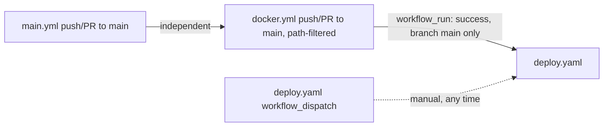

# Infrastructure

Docker Compose, Kubernetes manifests, CI/CD, and local dev entry points, as actually
configured in the repo (not as documented — several divergences are called out explicitly).

## Docker Compose: two files, and how they differ

Both `docker-compose.yaml` and `docker-compose.dev.yml` exist and are **not**
interchangeable. Root `CLAUDE.md` already flags this; here is the precise diff.

| Aspect | `docker-compose.yaml` (unified) | `docker-compose.dev.yml` (dev) |
|---|---|---|
| Compose `name:` | `ecommerce-platform` | (unset — defaults to directory name) |
| Postgres topology | **One** `postgres-server` container, database `Ecommerce` (capital E, singular), all four service DBs created inside it via `docker/postgres/init/v1__create__databases.sql` mounted at `/docker-entrypoint-initdb.d`. Exposed `5433:5432`. | **Four** separate Postgres containers: `postgres-user` (5433), `postgres-product` (5434), `postgres-order` (5435), `postgres-payment` (5436) — each `postgres:16-alpine` (vs. `postgres:15` in the unified file) with its own named volume. |
| Redis container name | `redis-server` | `redis` |
| Zipkin | `openzipkin/zipkin:latest`, `STORAGE_TYPE: mem` | identical |
| RedisInsight | Present, `5540:5540`, depends on `redis-server` healthy | **Absent** — no RedisInsight service in the dev file |
| Build context | Each service builds with `context: ./<service>`, `dockerfile: Dockerfile` (context scoped to the module dir) | Each service builds with `context: .` (repo root), `dockerfile: <service>/Dockerfile` (context is the whole repo) — required because every Dockerfile `COPY`s sibling modules' `pom.xml` files (see Dockerfiles below); **the unified file's per-module build context cannot actually satisfy those `COPY api-gateway/pom.xml ...` lines**, since the module subdirectory doesn't contain its sibling modules. This is a real build-breaking inconsistency between the two compose files given the Dockerfiles as written. |
| `SPRING_PROFILES_ACTIVE` | **Not set** for any backend service or gateway (only `frontend-service` sets `SPRING_PROFILES_ACTIVE=local`) — backend services run their bare `application.yml` (default profile). | Set to `local` for every service including `api-gateway`, so every service picks up its `application-local.yml` overrides (different Resilience4j numbers, different Redis env var names, health/actuator exposure, etc. — see `architecture.md`). |
| Healthchecks | None defined on any application container (only the `postgres-server`/`redis-server` infra healthchecks). `depends_on` uses `condition: service_healthy` for Postgres/Redis and bare `service_started`/no condition for `frontend-service` -> `api-gateway`. | Every application service has a `curl -f http://localhost:<port>/actuator/health` healthcheck (30s interval, 10s timeout, 5 retries, 90-120s `start_period`), and `depends_on` chains use `condition: service_healthy` throughout, including `order-service` waiting on `product-service` and `payment-service`, and `api-gateway` waiting on all four backend services. |
| `api-gateway` env: `USER_SERVICE_URL` | `http://user-service:8080` (normal DNS) | `http://host.docker.internal:8081` — points at the **host machine**, port 8081, not the containerized `user-service` at all. Combined with `extra_hosts: host.docker.internal:host-gateway`. This means the dev compose file expects `user-service` to be run manually on the host (e.g. from an IDE) rather than in the `user-service` container it also defines — the containerized `user-service` in this same file is then unreachable from `api-gateway` unless something is separately listening on the host at 8081. |
| Ports exposed | `api-gateway` 8765, `frontend-service` 3000, `zipkin` 9411, `redisinsight` 5540, `redis` 6379, `postgres` 5433 | `api-gateway` 8765, `frontend-service` 3000, `zipkin` 9411, `redis` 6379, four Postgres ports 5433-5436. No individual backend service ports are published in either file — `user-service`/`product-service`/`order-service`/`payment-service` are only reachable through `api-gateway` or the Docker network. |
| Passwords | `test1234` for Postgres, both files | identical |

`root CLAUDE.md`'s claim that `docker-compose.yaml` "mirrors k8s" is accurate for the
single-Postgres, single-`postgres-server`-hostname topology (matches `k8s/postgres/`), but the
unified file's per-module build `context` is inconsistent with every Dockerfile's multi-module
`COPY` list — see Dockerfiles below.

## `.env`

`.env` (excluded from images via `.dockerignore`) defines defaults consumed by
`docker-compose` var substitution: `ZIPKIN_BASE_URL`, an unused
`EUREKA_CLIENT_SERVICEURL_DEFAULTZONE` (no Eureka server exists anywhere in this repo — dead
variable), `SPRING_DATASOURCE_USERNAME`/`PASSWORD` (`postgres`/`test1234`), and
per-service `*_SPRING_DATASOURCE_URL` variables that all point at `localhost:5432` — not
consumed by either compose file directly (both compose files hardcode their own
`SPRING_DATASOURCE_URL` per service instead), so `.env`'s datasource URLs appear to be for a
non-Docker, all-services-on-`localhost` local run rather than for the compose files.

## Dockerfile build strategy

All six Dockerfiles (`api-gateway`, `user-service`, `product-service`, `order-service`,
`payment-service`, `frontend-service`) follow the same two-stage pattern:

1. **Builder** — `maven:3.9-eclipse-temurin-21`. Copies the root `pom.xml`, then explicitly
   `COPY`s every module's `pom.xml` (`api-gateway`, `user-service`, `product-service`,
   `order-service`, `payment-service`, `frontend-service`, `common`) so `mvn
   dependency:go-offline` can resolve the full reactor before source is copied — this is a
   Docker layer-caching optimization. Then `COPY . .` (full source) and
   `mvn clean package -DskipTests -pl <module> -am` (build just that module plus its
   dependencies, e.g. `common`).
2. **Runtime** — `eclipse-temurin:21-jre`. Installs `curl` (for healthchecks), copies
   `<module>/target/*.jar` as `app.jar`, `ENTRYPOINT ["java", "-jar", "app.jar"]`.

Per-service differences:
- `api-gateway` and `frontend-service` have an in-image `HEALTHCHECK` instruction
  (curl `/actuator/health`, 30s interval, 60s start period, 3 retries) and an `EXPOSE`.
  `user-service`, `product-service`, `order-service`, `payment-service` have **no**
  `HEALTHCHECK` and **no** `EXPOSE` in their Dockerfiles at all — container-level health
  checking for those four only exists via `docker-compose.dev.yml`'s compose-level
  `healthcheck:` blocks, and is entirely absent when running `docker-compose.yaml`.
- `frontend-service`'s `HEALTHCHECK` curls `http://localhost:8080/actuator/health` and
  `EXPOSE 8080` (`frontend-service/Dockerfile`), but the application itself listens on port
  3000 (`server.port: 8080` is not set anywhere; `application.yml:1-2` sets `server.port:
  3000`, and both compose files publish `3000:3000` for this service). The Dockerfile's
  in-image healthcheck therefore checks a port the app never binds and will always fail if
  Docker actually enforces it (`docker ps` would show the container as `unhealthy`).
- As noted above, every Dockerfile's build stage assumes a **repo-root build context**
  (it `COPY`s sibling-module `pom.xml` paths like `api-gateway/pom.xml`), which only works
  when invoked with `context: .` — exactly what `docker-compose.dev.yml` does and what
  `docker-compose.yaml` does **not** do (it sets `context: ./<service>` per service).
  Building via `docker-compose.yaml` as written will fail at the `COPY api-gateway/pom.xml
  api-gateway/pom.xml` step for every service, since the build context is the module
  subdirectory, not the repo root.

## Kubernetes manifest inventory

```
k8s/
├── namespace.yaml            Namespace "ecommerce"
├── rbac/                     ServiceAccount + Role + RoleBinding + Secret for a
│                              "github-actions" CI deploy identity (scoped to
│                              deployments/replicasets create/delete/patch/etc.)
├── postgres/                 ConfigMap, Deployment, Secret, Service, PVC (1Gi),
│                              init-scripts ConfigMap (creates the 4 DBs)
├── redis/                    Deployment, Service, PVC (1Gi) — no ConfigMap, no Secret
└── services/
    ├── api-gateway/          ConfigMap, Deployment (3 replicas), Service (LoadBalancer)
    ├── user-service/         ConfigMap, Deployment (1 replica), Service (ClusterIP, no type set -> defaults to ClusterIP)
    ├── product-service/      ConfigMap, Deployment (1 replica), Service
    ├── order-service/        ConfigMap, Deployment (1 replica), Service
    └── payment-service/      ConfigMap, Deployment (1 replica), Service
```

**No `frontend-service` manifest exists anywhere under `k8s/`.** There is no ConfigMap,
Deployment, or Service for `frontend-service` — the application described in `README.md` and
`CLAUDE.md` as the web client has no path to run on Kubernetes with these manifests as they
stand.

What each manifest contains, and what's missing:
- **Namespace**: `k8s/postgres/postgres-deployment.yaml` has **no `namespace:` field** in its
  `metadata` (`k8s/postgres/postgres-deployment.yaml:1-4`) — every other Deployment
  explicitly sets `namespace: ecommerce`. Applied as-is, `kubectl apply -f
  k8s/postgres/postgres-deployment.yaml` (without `-n ecommerce` on the command line or a
  context default namespace) creates the Postgres Deployment in `default`, not `ecommerce`,
  while its Service, PVC, ConfigMap, and Secret all correctly target `ecommerce` — the
  Deployment would then be unable to resolve `postgres-config`/`postgres-secret` unless those
  happen to also exist in `default`, and the `postgres-server` Service in `ecommerce` would
  have no matching pod to select.
- **Probes**: no manifest anywhere under `k8s/` (Postgres, Redis, or any of the five
  application services) defines `readinessProbe` or `livenessProbe`. The only startup
  ordering mechanism is `initContainers` running a `busybox` `nc -z <host> <port>` wait-loop
  (present on `api-gateway`, `order-service`, `payment-service`, `product-service`,
  `user-service` — waiting on `redis-server`/`postgres-server` respectively). A pod can be
  marked `Ready` and receive traffic before the Spring Boot app inside has finished starting.
- **Resource limits**: present and consistent on every workload. Application services:
  requests `250m`/`512Mi`, limits `1`/`1Gi`. Postgres and Redis: requests `250m`/`256Mi`,
  limits `1`/`1Gi`. Init containers: `100m`/`64Mi` limit only (no request).
- **Ingress**: none. No `Ingress` resource anywhere under `k8s/`. External access is only via
  `api-gateway`'s `Service` of `type: LoadBalancer` (`k8s/services/api-gateway/api-gateway-service.yaml`),
  which on a cloud provider provisions an external load balancer directly; on a cluster without
  cloud LB support (e.g. plain kubeadm/minikube) this Service would stay `<pending>`.
- **HPA**: none. No `HorizontalPodAutoscaler` manifest exists; `api-gateway` is statically set
  to `replicas: 3`, every other service to `replicas: 1`.
- **Secrets**: `k8s/postgres/postgres-secret.yaml` hardcodes
  `POSTGRES_PASSWORD: dGVzdDEyMzQ=` — this is base64, not encryption; it decodes to
  `test1234`, the same dev password used everywhere else, checked directly into the repo as a
  Kubernetes `Secret` manifest. Every service Deployment references this same
  `postgres-secret`/`POSTGRES_PASSWORD` key for its `SPRING_DATASOURCE_PASSWORD` env var.
- **ConfigMaps carry embedded `application.yml`**: `api-gateway-config`, `order-service-config`,
  `payment-service-config`, `product-service-config`, `user-service-config` each embed a full
  `application.yml` block (gateway routes / Feign client URLs / Eureka-disable) as a ConfigMap
  data key, in addition to individual key-value env entries — but no Deployment actually mounts
  this `application.yml` key as a file (no `volumeMounts` referencing it), so this embedded
  YAML is present in the ConfigMap but never consumed by the running pod. Only the discrete
  `SPRING_DATASOURCE_URL`/`SPRING_DATA_REDIS_HOST`/etc. keys are wired via `env.valueFrom.configMapKeyRef`.
- **Images**: all reference `ghcr.io/khaledawashreh/ecommerce-microservices-platform/<service>:latest`
  with `imagePullSecrets: github-container-registry` — that secret is never created by any
  manifest in this repo (not in `k8s/rbac/`, not elsewhere); it must exist in-cluster already
  by some other process for image pulls to succeed.

## CI/CD pipeline chain

Three workflows under `.github/workflows/`, chained by trigger, not by `needs:`.



**`main.yml`** ("build-and-test") — triggers on push/PR to `main`, no path filter (runs on
every change). Spins up ephemeral `postgres:16` (db `ecommerce`, user/pass `postgres`/`test1234`)
and `redis:7` GitHub Actions services. Steps: checkout, Java 21 (temurin), clears `~/.m2`
cache unconditionally before every run, Node 20 with npm cache, `npm ci`, `npm test --
--coverage --passWithNoTests` (Jest — no `*.test.js`/`*.spec.js` files exist in the repo, so
this step always passes vacuously via `--passWithNoTests`; `package.json` only declares a
`jest` devDependency and a `test` script, no actual test files), `mvn clean verify` (this is
what actually builds and tests the Java modules and runs JaCoCo, per root `CLAUDE.md`),
uploads jar artifacts, JaCoCo report, and pushes coverage to Codecov via `CODECOV_TOKEN`
secret. Note: the ephemeral Postgres service here is a single `ecommerce` database, not the
four-database-per-service layout the app expects at runtime — Maven's integration tests
instead rely on Testcontainers spinning up their own Postgres per `BaseIntegrationTest` (see
`conventions.md`), so this job-level Postgres/Redis service pair is not actually consumed by
`mvn clean verify`'s Testcontainers-based tests; its purpose in this pipeline is unclear from
the file alone.

**`docker.yml`** ("Build and Push Docker Images") — triggers on push/PR to `main` filtered to
`**.java`, `pom.xml`, `**/Dockerfile`, `.github/workflows/docker.yml` changes, plus manual
`workflow_dispatch` with an optional custom tag. Job `version` extracts the Maven project
version. Job `build-and-push` is a 6-way matrix (`api-gateway`, `user-service`,
`product-service`, `order-service`, `payment-service`, `frontend-service`), each built with
`context: .` (repo root — correct given the Dockerfiles' sibling-module `COPY`s), multi-arch
(`linux/amd64,linux/arm64`) via Buildx, pushed to `ghcr.io/${{ github.repository }}/<service>`
on non-PR events using the implicit `GITHUB_TOKEN`. Tags include branch ref, PR ref, commit
SHA, and on default-branch pushes, the Maven version and `latest`. Job `release` (main-branch
push only) creates a GitHub Release listing `docker pull` commands for all six images,
including `frontend-service` — even though `deploy.yaml` (below) never deploys it.

**`deploy.yaml`** ("Deploy") — triggers on `workflow_run` completion of `docker.yml` (only
when it concluded `success`, only on `main`), or manual `workflow_dispatch` with an image tag
input (default `latest`). Authenticates to Kubernetes via `azure/k8s-set-context@v4` using
`secrets.K8S_URL` and `secrets.KUBERNETES_SECRET` (service-account method). Applies, in order:
`k8s/namespace.yaml`, the three `k8s/rbac/*.yaml` files, then the five backend services'
ConfigMaps individually via `kubectl apply -f`, then deploys via `azure/k8s-deploy@v5` with an
explicit manifest list (`api-gateway`, `user-service`, `product-service`, `order-service`,
`payment-service` — Deployment + Service each) and matching image list.

Gaps in `deploy.yaml` as written:
- **Never applies `k8s/postgres/*.yaml` or `k8s/redis/*.yaml`.** Every backend Deployment's
  `initContainer` waits on `postgres-server:5432`/`redis-server:6379`, and every ConfigMap's
  `SPRING_DATASOURCE_URL` points at `postgres-server`. On a cluster that has never had those
  manifests applied by hand, this workflow deploys five services whose init containers will
  wait forever for a Postgres/Redis Service that does not exist.
- **Never deploys `frontend-service`** — consistent with there being no manifest for it, but
  means the "Deploy" workflow cannot stand up anything a browser can reach without the
  gateway's raw JSON API.
- **Never applies the `postgres-secret`** referenced by every service Deployment's
  `SPRING_DATASOURCE_PASSWORD` `secretKeyRef` — same gap as Postgres/Redis manifests.

Secrets required across the three workflows: `CODECOV_TOKEN` (main.yml), `GITHUB_TOKEN`
(implicit, docker.yml GHCR push), `K8S_URL` and `KUBERNETES_SECRET` (deploy.yaml, cluster
auth). No secret named for the `github-container-registry` `imagePullSecret` the Deployments
reference — it is not created by any workflow or manifest in this repo.

## Local dev entry points

- `./start.sh [-b] [-f]` — hardcodes `COMPOSE_FILE="docker-compose.dev.yml"`. `-b` rebuilds
  first, `-f` follows logs. After `up -d`, unconditionally prints a service-URL banner that is
  **wrong for this repo**: it lists `Eureka Dashboard: http://localhost:8761` and
  `Config Server: http://localhost:8888` — neither a Eureka server nor a Config Server exists
  anywhere in this codebase (no such module, no such container in either compose file). It
  also prints `PostgreSQL (Product): localhost:5432`, `(User): localhost:5433`,
  `(Payment): localhost:5434`, `(Order): localhost:5435` — these port numbers do not match
  `docker-compose.dev.yml`, which actually publishes `postgres-user` on 5433,
  `postgres-product` on 5434, `postgres-order` on 5435, `postgres-payment` on 5436 (every
  service in the printed list is off by one container, and product/user are swapped relative
  to the actual mapping). The printed banner appears to be leftover from an earlier iteration
  of this project's architecture (Eureka + Config Server) and was not updated when the
  Postgres-per-service ports or the service-discovery approach changed.
- `./stop.sh [-v]` — also hardcodes `docker-compose.dev.yml`; `-v` additionally removes
  volumes (data loss, confirmed by an explicit warning echo).
- `./image.sh` — loops `api-gateway user-service product-service order-service
  payment-service` (no `frontend-service`) and runs `docker build -t
  kmawashreh/personal_projects_repo/general:$svc ./$svc` then `docker push` to that same tag
  for every service. This tag scheme (`kmawashreh/personal_projects_repo/general:<service>`)
  does not match the GHCR image naming used by `docker.yml`
  (`ghcr.io/${{ github.repository }}/<service>`) or by the `k8s/services/*/*.yaml` Deployments
  (`ghcr.io/khaledawashreh/ecommerce-microservices-platform/<service>:latest`) — `image.sh` pushes
  to a different registry/repo entirely and is disconnected from both CI and the k8s
  manifests. Also builds with `context: ./$svc` (module-relative), which — per the Dockerfile
  analysis above — will fail on the `COPY api-gateway/pom.xml ...` step for every module
  except a hypothetical service with no sibling-module dependencies.
- **`start.makefile`** — present at repo root, **not** wired to any `make` invocation
  documented elsewhere (root `CLAUDE.md` does not mention it), and broken as written:
  - Target syntax is missing colons throughout (`start-config` instead of `start-config:`,
    `start-eureka start-config` instead of `start-eureka: start-config`, etc. — lines 10, 16,
    22, 27, 31) — this is not valid Makefile syntax; `make` would fail to parse targets with
    prerequisites this way.
  - References `CONFIG_SERVICE_DIR=.config-service`, `EUREKA_SERVICE_DIR=.naming-server`,
    `API_GATEWAY_DIR=.api-gateway` (`start.makefile:2-4`) — none of these directories exist
    anywhere in the repository (the actual gateway module is `api-gateway/`, not
    `.api-gateway`, and there is no config-service or naming-server module at all, consistent
    with there being no Eureka/Config Server anywhere else in the codebase).
  - `MVN = mvn spring-bootrun` (`start.makefile:7`) — the actual Maven Spring Boot goal is
    `spring-boot:run`, not `spring-bootrun`; as written this is not a valid Maven goal.
  - The final `.PHONY` line is also missing its colon (`.PHONY start-config ...` instead of
    `.PHONY: start-config ...`, line 35).
  - Net effect: `start.makefile` cannot run as-is against this repository under any
    interpretation — wrong syntax, wrong module directories, wrong Maven goal, for services
    (Config Server, Eureka) that do not exist in this codebase.
- `docker-compose -f docker-compose.dev.yml up -d` / `down` — the docker-based path documented
  in root `CLAUDE.md`, and the one `start.sh`/`stop.sh` wrap.
- Maven: `mvn clean install` (full reactor), `mvn -pl <module> [-am] test`, `mvn clean verify`
  (what `main.yml` runs) — see root `pom.xml`, a parent POM with `packaging: pom`, seven
  modules, and a single `pluginManagement` entry pinning `jacoco-maven-plugin:0.8.10`. No
  Spring Boot parent BOM or dependency management is declared at the root — each module's own
  `pom.xml` presumably manages its own Spring Boot version (not verified here; see per-module
  docs).
