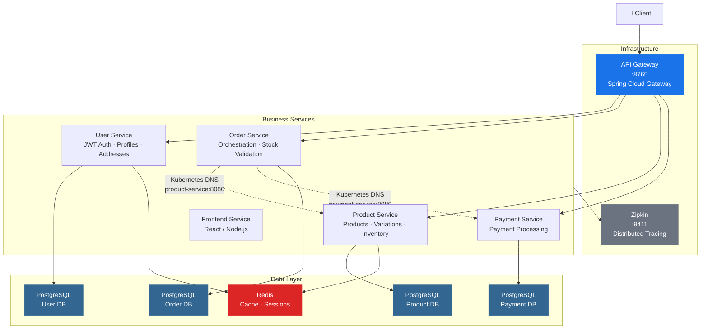
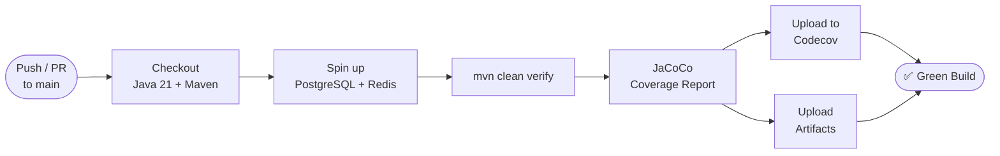

# ecommerce-microservices-platform

> Production-grade e-commerce microservices platform demonstrating enterprise-grade architecture, distributed systems patterns, and DevOps best practices.

A full-stack microservices platform built with Spring Boot, Docker, Kubernetes, and GitHub Actions. Implements service discovery, API gateway routing, fault-tolerant inter-service communication, distributed tracing, and automated CI/CD pipelines.

**Stack:** Spring Boot 3 · Spring Cloud Gateway · Kubernetes DNS · OpenFeign · Resilience4j · PostgreSQL · Redis · Zipkin · Docker · Kubernetes · GitHub Actions

---

## 📊 Project Status

| Dimension | Status |
|-----------|--------|
| Docker Compose (local dev) | ✅ Complete |
| Inter-service communication | ✅ Complete |
| CI/CD pipelines | ✅ Complete |
| Kubernetes deployment | 🚧 Partial (core manifests) |
| Integration testing | 🚧 In progress |
| Observability (Prometheus/Grafana) | ⏳ Planned |
| Performance testing | ⏳ Planned |

---

## Architecture



### Key Architectural Decisions

| Decision | Rationale |
|----------|-----------|
| **Per-service PostgreSQL schemas** | Data isolation, independent scaling, failure containment |
| **Synchronous Feign + Resilience4j** | Simplicity over eventual consistency; circuit breakers prevent cascade failures |
| **Kubernetes DNS for service discovery** | Native K8s service-to-service resolution; no additional registry dependency |
| **Compensating transactions** | Order cancellation triggers inventory restoration — no saga/orchestrator overhead |
| **Zipkin distributed tracing** | End-to-end request visibility across service boundaries |

---

## Services

| Service | Port | Technology | Responsibility |
|---------|------|------------|---------------|
| **API Gateway** | 8765 | Spring Cloud Gateway | Request routing, circuit breaker, retry, rate limiting |
| **User Service** | Dynamic | Spring Boot + JWT | Authentication, user profiles, addresses |
| **Product Service** | Dynamic | Spring Boot | Products, variations, inventory management |
| **Order Service** | Dynamic | Spring Boot + Feign | Order orchestration, stock validation, cart-to-order |
| **Payment Service** | Dynamic | Spring Boot | Payment processing (simulated gateway) |
| **Frontend Service** | Dynamic | React + Node | Web client (portfolio showcase) |

---

## Quick Start

### Prerequisites
- Docker & Docker Compose
- Java 21
- Maven 3.9+

### One-command startup

```bash
docker-compose -f docker-compose.dev.yml up -d
```

Or with the convenience script:

```bash
chmod +x start.sh && ./start.sh
```

### Service URLs

| Service | URL |
|---------|-----|
| API Gateway | http://localhost:8765 |
| Zipkin Tracing | http://localhost:9411 |

### Key API Endpoints

```
POST /api/v1/users/register      # User registration
POST /api/v1/users/login          # Login → JWT token
GET  /api/v1/products            # List products (paginated)
GET  /api/v1/products/{id}      # Get product details
POST /api/v1/products            # Create product
GET  /api/v1/orders              # List orders (buyer/seller/status filters)
POST /api/v1/orders              # Create order (validates stock, deducts inventory)
POST /api/v1/payments/process     # Process payment
GET  /actuator/health            # Health check (any service)
```

### Stop

```bash
docker-compose -f docker-compose.dev.yml down
```

---

## Technology Stack

| Layer | Technology | Version |
|-------|-----------|---------|
| Framework | Spring Boot | 3.x |
| Language | Java | 21 |
| API Gateway | Spring Cloud Gateway | 2023.x |
| Service Discovery | Kubernetes DNS | K8s native |
| Inter-service | Spring Cloud OpenFeign | 4.x |
| Fault Tolerance | Resilience4j | 2.x |
| Databases | PostgreSQL | 16 |
| Cache | Redis | 7 |
| Distributed Tracing | Zipkin | 3.x |
| Containerization | Docker | 24.x |
| Orchestration | Kubernetes | 1.29+ |
| CI/CD | GitHub Actions | — |
| Testing | JUnit 5 + TestContainers | — |
| Code Coverage | JaCoCo | 0.8.x |
| Container Registry | GitHub Container Registry (GHCR) | — |

---

## Distributed Systems Patterns

### Circuit Breaker (Resilience4j)
```yaml
circuit-breaker:
  failure-rate-threshold: 50
  wait-duration-in-open-state: 60s
  sliding-window-type: count-based
  sliding-window-size: 10
retry:
  max-attempts: 3
  wait-duration: 500ms
  exponential-backoff-multiplier: 2
```

### Compensating Transaction (Order → Inventory)
```
Order creation flow:
1. Validate stock via Product Service (circuit breaker protected)
2. Save order with PENDING status
3. Deduct inventory
   └─ Success  → Mark CONFIRMED
   └─ Failure  → Restore inventory, mark CANCELLED
```

### Feign Client (Order → Product)

Services discover each other via **Kubernetes DNS** — e.g., `http://product-service:8080`. Feign clients call by service name with Resilience4j protection:

```java
@FeignClient(name = "product-service", url = "http://product-service:8080",
             fallback = ProductServiceFallback.class)
public interface ProductServiceClient {
    @GetMapping("/api/v1/product/{sku}")
    ProductDto retrieveProduct(@PathVariable UUID sku);

    @GetMapping("/api/v1/inventory/{sku}")
    InventoryDto retrieveInventory(@PathVariable UUID sku);

    @PutMapping("/api/v1/inventory/{sku}/deduct")
    boolean deductInventory(@PathVariable UUID sku, @RequestParam int quantity);
}
```
```

---

## Database Schema

### Product Service
```sql
products (id, name, description, category, owner_id, created_at, updated_at)
product_variations (id, product_id, sku, name, price, stock_quantity, is_active)
inventory (id, product_variation_id, quantity, reserved_quantity, warehouse_location, created_at, updated_at)
```

### Order Service
```sql
orders (id, buyer, seller, store_id, status, created_at, updated_at, created_by, updated_by)
order_items (id, order_id, product_sku, quantity, unit_price)
discounts (id, order_id, code, discount_type, value)
```

### User Service
```sql
users (id, email, password_hash, first_name, last_name, phone, is_active, created_at, updated_at)
addresses (id, user_id, street, city, postal_code, country, is_default)
```

### Payment Service
```sql
payments (id, order_id, buyer_id, amount, payment_method, status, transaction_id, payment_gateway, created_at, updated_at)
```

---

## Docker Compose

`docker-compose.dev.yml` orchestrates the full local development environment:

**Infrastructure (6 containers):**
- PostgreSQL ×4 — isolated schemas per service
- Redis — session storage + caching
- Zipkin — distributed tracing UI

**Application services (7 containers):**
- API Gateway, User, Product, Order, Payment, Frontend services

### Environment Configuration

| Variable | Default | Purpose |
|----------|---------|---------|
| `SPRING_PROFILES_ACTIVE` | `local` | Spring profile |
| `ZIPKIN_BASE_URL` | http://zipkin:9411 | Zipkin URL |
| `SPRING_DATASOURCE_URL` | jdbc:postgresql://host:5432/db | DB connection |
| `SPRING_DATA_REDIS_HOST` | `redis` | Redis host |
| `POSTGRES_PASSWORD` | `test1234` | Database password |

---

## Kubernetes

Kubernetes manifests under `k8s/`:

```
k8s/
├── namespace.yaml
├── postgres/         # Deployment, Service, ConfigMap, Secret, PVC, init scripts
├── redis/            # Deployment, Service, PVC
└── services/         # api-gateway, user, product, order, payment
                       # (deployment + service + configmap per service)
```

### Kubernetes — Production Hardening

- [ ] Ingress controller + Ingress rules
- [ ] Resource `requests`/`limits` on all workloads
- [ ] Liveness and readiness probes
- [ ] Rolling update strategy configuration
- [ ] Network policies (zero-trust between namespaces)
- [ ] Horizontal Pod Autoscaler (HPA) for business services

> **Note:** The codebase targets Docker Compose for local development and Docker for production. Kubernetes manifests are provided as a deployment option. Service-to-service communication uses Kubernetes DNS (`product-service`, `payment-service`, etc.). Full Kubernetes-native deployment is planned.

---

## CI/CD

### Build & Test Pipeline (`main.yml`)



- Runs on every push and PR to `main`
- JaCoCo coverage reporting → Codecov
- Jest coverage for frontend service
- Coverage artifacts downloadable

### Docker Image Pipeline (`docker.yml`)

- Builds all 6 microservice images on Java/pom changes
- Pushes to **GitHub Container Registry** (`ghcr.io/kawashreh/ecommerce-microservices-platform/*`)
- Multi-arch: `linux/amd64` + `linux/arm64`
- Tags: `latest`, version, commit SHA
- GitHub Release created on main branch push

**Available images:**
```bash
docker pull ghcr.io/kawashreh/ecommerce-microservices-platform/api-gateway:latest
docker pull ghcr.io/kawashreh/ecommerce-microservices-platform/user-service:latest
docker pull ghcr.io/kawashreh/ecommerce-microservices-platform/product-service:latest
docker pull ghcr.io/kawashreh/ecommerce-microservices-platform/order-service:latest
docker pull ghcr.io/kawashreh/ecommerce-microservices-platform/payment-service:latest
docker pull ghcr.io/kawashreh/ecommerce-microservices-platform/frontend-service:latest
```

### Build Locally

```bash
# All services
mvn clean install

# Single service
cd <service> && mvn clean package
```

---

## Testing

### Current Coverage

| Service | Type | Status |
|---------|------|--------|
| Product Service | Unit + Integration (TestContainers) | ✅ Active |
| Order Service | Unit + Integration (TestContainers) | ✅ Active |
| Inventory | Integration tests with concurrent scenarios | ✅ Active |

### Testing — Coverage Expansion

- [ ] **OrderService** — complete unit test suite (CRUD, stock validation, compensating transactions)
- [ ] **UserService** — unit tests: register, login, profile CRUD
- [ ] **ProductService** — unit tests: CRUD + search + variation management
- [ ] **Controller layer** — REST integration tests for all endpoints
- [ ] **WebClient/Feign calls** — mocked integration tests for inter-service communication
- [ ] **Circuit breaker behavior** — fallback + recovery test scenarios
- [ ] **JaCoCo report** — target **30%** aggregate coverage

> **Approach:** Focus on service layer unit tests and TestContainers-based integration tests covering the critical paths: order creation (with stock validation), payment processing, and inventory management.

---

## Observability — Planned

- [ ] **Spring Boot Actuator** — expose `/actuator/prometheus` on all services
- [ ] **Prometheus** — deploy to Kubernetes, configure scrape jobs for all services
- [ ] **Grafana** — deploy, configure Prometheus datasource, import Spring Boot dashboard
- [ ] **Custom business metrics** — order creation count, stock deductions, auth failures
- [ ] **Alerting rules** — high error rate (>5%), service down detection
- [ ] **Documentation** — monitoring setup guide with screenshots

---

## Performance & Optimization — Planned

- [ ] **k6 load testing** — baseline performance tests for product listing, order creation, auth
- [ ] **Database optimization** — indexes on foreign keys, `ORDER BY` columns; N+1 query detection
- [ ] **HikariCP tuning** — connection pool sizing per service
- [ ] **Redis caching** — cache product listings and hot read paths
- [ ] **Cache hit rate monitoring** — measure and document improvement
- [ ] **Benchmark report** — before/after performance comparison

> **Priority:** Database indexing and Redis caching are highest-impact and can be completed in a single session. Load testing provides concrete numbers for interviews.

---

## Engineering Excellence — Planned

- [ ] **Architecture diagram** — draw.io diagram showing all services, data flows, and integration points (PNG for README)
- [ ] **Demo video** — 3-minute walkthrough: docker-compose startup → API calls → K8s deployment → Grafana dashboards
- [ ] **Technical blog post** — "Building Production-Ready Microservices with Spring Boot and Kubernetes" on Dev.to/Medium
- [ ] **OpenAPI/Swagger** — API documentation via springdoc-openapi
- [ ] **Postman collection** — executable API examples for recruiters/interviewers
- [ ] **Code hygiene** — remove dead code, resolve all `@SuppressWarnings`, enforce Spotless formatting

---

## Roadmap

| Phase | Focus | Target |
|-------|-------|--------|
| ✅ Phase 1 | Local dev environment | Feb 2026 |
| ✅ Phase 2 | Service integration | Feb 2026 |
| ✅ Phase 3 | CI/CD pipelines | Mar 2026 |
| 🚧 Phase 4 | Integration testing | Mar 2026 |
| 🚧 Phase 5 | Kubernetes hardening | Mar 2026 |
| ⏳ Phase 6 | Observability (Prometheus/Grafana) | Mar–Apr 2026 |
| ⏳ Phase 7 | Performance optimization | Apr 2026 |
| ⏳ Phase 8 | Polish + applications | Apr 2026 |

---

## License

MIT
