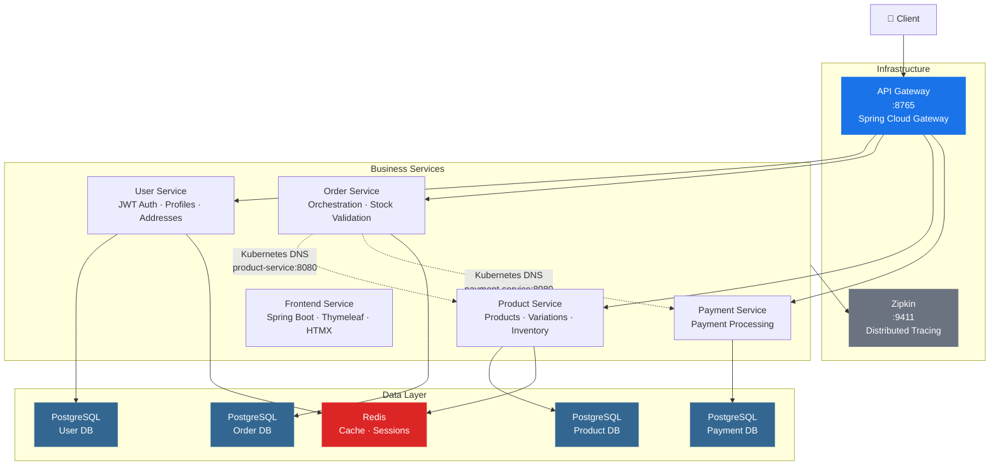
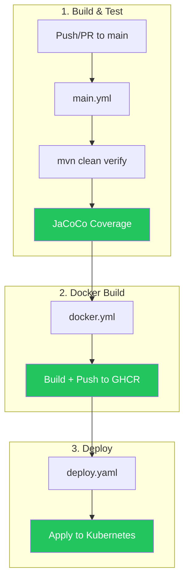
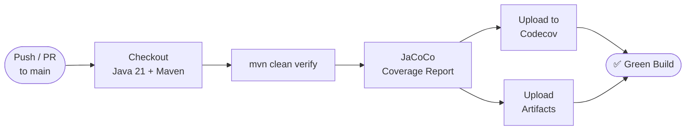
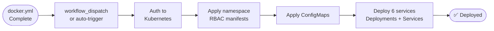

# ecommerce-microservices-platform

> Production-grade e-commerce microservices platform demonstrating enterprise-grade architecture, distributed systems patterns, and DevOps best practices.

A full-stack microservices platform built with Spring Boot, Docker, Kubernetes, and GitHub Actions. Implements service discovery, API gateway routing, fault-tolerant inter-service communication, distributed tracing, and automated CI/CD pipelines.

**Stack:** Spring Boot 3 · Spring Cloud Gateway · Kubernetes DNS · OpenFeign · Resilience4j · PostgreSQL · Redis · Zipkin · Docker · Kubernetes · GitHub Actions

---

## 📊 Project Status

| Dimension | Status |
|-----------|--------|
| Docker Compose (local dev) | ✅ Complete |
| Inter-service communication | ✅ Complete |
| CI/CD pipelines | ✅ Complete |
| Kubernetes deployment | ✅ Complete |
| Integration testing | 🚧 In progress |
| Observability (Prometheus/Grafana) | ⏳ Planned |
| Performance testing | ⏳ Planned |

---

## Architecture


```mermaid
graph TB
    Client["👤 Client"]

    subgraph Infrastructure["Infrastructure"]
        Gateway["API Gateway<br/>:8765<br/>Spring Cloud Gateway"]
        Zipkin["Zipkin<br/>:9411<br/>Distributed Tracing"]
    end

    subgraph Services["Business Services"]
        User["User Service<br/>JWT Auth · Profiles · Addresses"]
        Order["Order Service<br/>Orchestration · Stock Validation"]
        Product["Product Service<br/>Products · Variations · Inventory"]
        Payment["Payment Service<br/>Payment Processing"]
        Frontend["Frontend Service<br/>Spring Boot · Thymeleaf · HTMX"]
    end

    subgraph Data["Data Layer"]
        PG1["PostgreSQL<br/>User DB"]
        PG2["PostgreSQL<br/>Product DB"]
        PG3["PostgreSQL<br/>Order DB"]
        PG4["PostgreSQL<br/>Payment DB"]
        Redis["Redis<br/>Cache · Sessions"]
    end

    Client --> Gateway
    Gateway --> User
    Gateway --> Order
    Gateway --> Product
    Gateway --> Payment

    Order -.->|"Kubernetes DNS<br/>product-service:8080"| Product
    Order -.->|"Kubernetes DNS<br/>payment-service:8080"| Payment

    User --> PG1
    Product --> PG2
    Order --> PG3
    Payment --> PG4

    User --> Redis
    Services --> Zipkin
    Product --> Redis

    style Gateway fill:#1a73e8,color:#fff,stroke:#1a73e8
    style Zipkin fill:#6b7280,color:#fff,stroke:#6b7280
    style Redis fill:#dc2626,color:#fff,stroke:#dc2626
    style PG1 fill:#336791,color:#fff,stroke:#336791
    style PG2 fill:#336791,color:#fff,stroke:#336791
    style PG3 fill:#336791,color:#fff,stroke:#336791
    style PG4 fill:#336791,color:#fff,stroke:#336791
```

### Key Architectural Decisions

| Decision | Rationale |
|----------|-----------|
| **Per-service PostgreSQL schemas** | Data isolation, independent scaling, failure containment |
| **Synchronous Feign + Resilience4j** | Simplicity over eventual consistency; circuit breakers prevent cascade failures |
| **Kubernetes DNS for service discovery** | Native K8s service-to-service resolution; no additional registry dependency |
| **Compensating transactions** | Order cancellation triggers inventory restoration — no saga/orchestrator overhead |
| **Zipkin distributed tracing** | End-to-end request visibility across service boundaries |

---

## Services

| Service | Port | Technology | Responsibility |
|---------|------|------------|---------------|
| **API Gateway** | 8765 | Spring Cloud Gateway | Request routing, circuit breaker, retry, rate limiting |
| **User Service** | 8080 | Spring Boot + JWT | Authentication, user profiles, addresses |
| **Product Service** | 8080 | Spring Boot | Products, variations, inventory management |
| **Order Service** | 8080 | Spring Boot + Feign | Order orchestration, stock validation, cart-to-order |
| **Payment Service** | 8080 | Spring Boot | Payment processing (simulated gateway) |
| **Frontend Service** | 3000 | Spring Boot + HTMX | SSR web client (portfolio showcase) |

> Ports are fixed in the shipped config (`server.port=0`, i.e. a random port, only
> applies under the `test` profile). User/Product/Order/Payment Service all happen to
> share 8080 — harmless since each runs in its own container — but only API Gateway
> (8765) and Frontend Service (3000) are published to the host; reach the others
> through the gateway or the Docker network.

---

## Quick Start

### Prerequisites
- Docker & Docker Compose
- Java 21
- Maven 3.9+

### One-command startup

```bash
docker-compose -f docker-compose.dev.yml up -d
```

Or with the convenience script:

```bash
chmod +x start.sh && ./start.sh
```

### Service URLs

| Service | URL |
|---------|-----|
| API Gateway | http://localhost:8765 |
| Zipkin Tracing | http://localhost:9411 |

### Key API Endpoints

```
POST /api/v1/users/register      # User registration
POST /api/v1/users/login          # Login → JWT token
GET  /api/v1/products            # List products (paginated)
GET  /api/v1/products/{id}      # Get product details
POST /api/v1/products            # Create product
GET  /api/v1/orders              # List orders (buyer/seller/status filters)
POST /api/v1/orders              # Create order (validates stock, deducts inventory)
POST /api/v1/payments/process     # Process payment
GET  /actuator/health            # Health check (any service)
```

### Stop

```bash
docker-compose -f docker-compose.dev.yml down
```

---

## Technology Stack

| Layer | Technology | Version |
|-------|-----------|---------|
| Framework | Spring Boot | 3.x |
| Language | Java | 21 |
| API Gateway | Spring Cloud Gateway | 2023.x |
| Service Discovery | Kubernetes DNS | K8s native |
| Inter-service | Spring Cloud OpenFeign | 4.x |
| Fault Tolerance | Resilience4j | 2.x |
| Databases | PostgreSQL | 16 |
| Cache | Redis | 7 |
| Distributed Tracing | Zipkin | 3.x |
| Containerization | Docker | 24.x |
| Orchestration | Kubernetes | 1.29+ |
| CI/CD | GitHub Actions | — |
| Testing | JUnit 5 + TestContainers | — |
| Code Coverage | JaCoCo | 0.8.x |
| Container Registry | GitHub Container Registry (GHCR) | — |

---

## Distributed Systems Patterns

### Circuit Breaker (Resilience4j)
```yaml
circuit-breaker:
  failure-rate-threshold: 50
  wait-duration-in-open-state: 60s
  sliding-window-type: count-based
  sliding-window-size: 10
retry:
  max-attempts: 3
  wait-duration: 500ms
  exponential-backoff-multiplier: 2
```

### Compensating Transaction (Order → Inventory)
```
Order creation flow:
1. Validate stock via Product Service (circuit breaker protected)
2. Save order with PENDING status
3. Deduct inventory
   └─ Success  → Mark CONFIRMED
   └─ Failure  → Restore inventory, mark CANCELLED
```

### Feign Client (Order → Product)

Services discover each other via **Kubernetes DNS** — e.g., `http://product-service:8080`. Feign clients call by service name with Resilience4j protection. Paths come from each module's centralized `ApiPaths` constants rather than being hardcoded on the annotations:

```java
@FeignClient(name = "product-service")
public interface ProductServiceClient {

    @GetMapping("/api/v1/product/{productId}")
    ProductDto retrieveProduct(@PathVariable UUID productId);

    @GetMapping("/api/v1/inventory/product-variation/{productVariationId}")
    InventoryDto retrieveInventory(@PathVariable UUID productVariationId);

    @GetMapping("/api/v1/inventory/product-variation/{productVariationId}/availability")
    Boolean checkInventoryAvailability(@PathVariable UUID productVariationId,
                                        @RequestParam int quantity);

    @PutMapping("/api/v1/inventory/product-variation/{productVariationId}/deduct")
    Boolean deductInventory(@PathVariable UUID productVariationId,
                             @RequestParam int quantity);

    @PutMapping("/api/v1/inventory/product-variation/{productVariationId}/restore")
    Boolean restoreInventory(@PathVariable UUID productVariationId,
                              @RequestParam int quantity);
}
```

---

## Database Schema

### Product Service
```sql
products (id, name, description, category, owner_id, created_at, updated_at)
product_variations (id, product_id, sku, name, price, stock_quantity, is_active)
inventory (id, product_variation_id, quantity, reserved_quantity, warehouse_location, created_at, updated_at)
```

### Order Service
```sql
orders (id, buyer, seller, store_id, status, created_at, updated_at, created_by, updated_by)
order_items (id, order_id, product_sku, quantity, unit_price)
discounts (id, order_id, code, discount_type, value)
```

### User Service
```sql
users (id, email, password_hash, first_name, last_name, phone, is_active, created_at, updated_at)
addresses (id, user_id, street, city, postal_code, country, is_default)
```

### Payment Service
```sql
payments (id, order_id, buyer_id, amount, payment_method, status, transaction_id, payment_gateway, created_at, updated_at)
```

---

## Docker Compose

`docker-compose.dev.yml` orchestrates the full local development environment:

**Infrastructure (6 containers):**
- PostgreSQL ×4 — isolated schemas per service
- Redis — session storage + caching
- Zipkin — distributed tracing UI

**Application services (7 containers):**
- API Gateway, User, Product, Order, Payment, Frontend services

### Environment Configuration

Copy `.env.example` to `.env` (gitignored) and fill in real values before running either
compose file — both files read `SPRING_DATASOURCE_PASSWORD` and `JWT_SECRET` via variable
substitution and refuse to start (`variable is not set` error from `docker compose`) if
either is missing, rather than falling back to a committed default.

| Variable | Default | Purpose |
|----------|---------|---------|
| `SPRING_PROFILES_ACTIVE` | `local` | Spring profile |
| `ZIPKIN_BASE_URL` | http://zipkin:9411 | Zipkin URL |
| `SPRING_DATASOURCE_URL` | jdbc:postgresql://host:5432/db | DB connection |
| `SPRING_DATA_REDIS_HOST` | `redis` | Redis host |
| `SPRING_DATASOURCE_PASSWORD` | *(none — required, from `.env`)* | Database password. A weak shared value is fine for local dev; just don't commit it. |
| `JWT_SECRET` | *(none — required, from `.env`)* | HS256 signing secret shared by `api-gateway` and `user-service`. Generate your own (`openssl rand -base64 48`) — do not reuse the value that used to be committed here. |

---

## Kubernetes

Kubernetes manifests under `k8s/`:

```
k8s/
├── namespace.yaml              # ecommerce namespace
├── rbac/                       # RBAC configuration
│   ├── serviceaccount.yaml     # github-actions service account
│   ├── role.yaml               # deployment role (namespace-scoped)
│   └── rolebinding.yaml        # binds role to service account
├── postgres/                   # Deployment, PVC, ConfigMap, Service, init scripts
├── redis/                      # Deployment, PVC, Service
└── services/                   # 6 microservices
    ├── api-gateway/            # + Ingress, HorizontalPodAutoscaler
    ├── user-service/
    ├── product-service/        # + NetworkPolicy
    ├── order-service/          # + NetworkPolicy
    ├── payment-service/        # + NetworkPolicy
    └── frontend-service/
        # each contains: <name>-deployment.yaml, <name>-service.yaml,
        # <name>-configmap.yaml, <name>-hpa.yaml (filenames are prefixed with
        # the service name, not literally "deployment.yaml")
```

### Local Development — Apply Manifests

```bash
# Apply namespace
kubectl apply -f k8s/namespace.yaml

# Apply RBAC (ServiceAccount, Role, RoleBinding)
kubectl apply -f k8s/rbac/

# Apply everything else — Postgres, Redis, and all services' ConfigMaps,
# Deployments, Services, HPAs, NetworkPolicies, and the api-gateway Ingress
kubectl apply -R -f k8s/postgres/ -f k8s/redis/ -f k8s/services/
```

### Postgres and JWT Secrets

`k8s/postgres/` intentionally does **not** contain a `Secret` manifest, and no `Secret`
manifest for the JWT signing key exists anywhere under `k8s/`. Both used to be committed
as base64-encoded (not encrypted) `Secret` YAML — base64 is trivially reversible, so that
was equivalent to committing the plaintext password/key. Create them out of band instead,
the same way the `deploy.yaml` workflow does it:

```bash
# Database password consumed by every service's SPRING_DATASOURCE_PASSWORD
kubectl create secret generic postgres-secret \
  --namespace ecommerce \
  --from-literal=POSTGRES_PASSWORD=<your-db-password>

# HS256 signing secret shared by api-gateway and user-service
kubectl create secret generic jwt-secret \
  --namespace ecommerce \
  --from-literal=JWT_SECRET=<your-jwt-secret>   # e.g. openssl rand -base64 48
```

`deploy.yaml` creates both from the `POSTGRES_PASSWORD` and `JWT_SECRET` GitHub Actions
secrets on every run, so a cluster deployed exclusively through that workflow never needs
this done by hand — this is only for a cluster you're standing up manually.

### GHCR Image Pull Secret Setup

To pull images from GitHub Container Registry, create an image pull secret in your Kubernetes cluster:

```bash
# Create secret for GHCR (replace OWNER with your GitHub username)
kubectl create secret docker-registry github-container-registry \
  --docker-server=ghcr.io \
  --docker-username=<your-github-username> \
  --docker-password=<github-personal-access-token> \
  --docker-email=<your-email> \
  -n ecommerce

# Or apply from manifest:
kubectl apply -f k8s/rbac/serviceaccount-secret.yaml
```

> **Note:** The deployment manifests reference `imagePullSecrets: - name: github-container-registry` to authenticate with GHCR.

### Deploy Workflow Secrets

The `deploy.yaml` workflow requires these GitHub secrets configured in your repository:

| Secret | How to Get |
|--------|------------|
| `K8S_URL` | Run `kubectl cluster-info` to get the API server URL |
| `KUBERNETES_SECRET` | Create a ServiceAccount with cluster-admin role, then get its token: `kubectl get secret <sa-token> -o jsonpath='{.data.token}' \| base64 -d` |
| `POSTGRES_PASSWORD` | Pick a value for the cluster's Postgres password; the workflow writes it into the `postgres-secret` `Secret` on every run (see Postgres and JWT Secrets above) |
| `JWT_SECRET` | Generate one (`openssl rand -base64 48`); the workflow writes it into the `jwt-secret` `Secret` on every run. Must not be the value that used to be committed to source |

### Kubernetes — Production Hardening

- [x] Ingress rules (`k8s/services/api-gateway/api-gateway-ingress.yaml`) — still requires an
      ingress controller (e.g. ingress-nginx) installed separately per cluster
- [x] Resource `requests`/`limits` on all workloads
- [x] Liveness and readiness probes on all workloads
- [ ] Rolling update strategy configuration
- [ ] Network policies (zero-trust between namespaces) — ingress-side policies exist for
      order/payment/product/user-service, but egress is unrestricted and api-gateway,
      frontend-service, postgres, and redis have none
- [x] Horizontal Pod Autoscaler (HPA) for business services — requires a metrics-server
      installed in-cluster to actually scale

> **Note:** The codebase targets Docker Compose for local development and Docker for production. Kubernetes manifests are provided as a deployment option. Service-to-service communication uses Kubernetes DNS (`product-service`, `payment-service`, etc.). Full Kubernetes-native deployment is planned.

---

## CI/CD

Full CI/CD pipeline with three workflows:


```mermaid
flowchart TB
    subgraph "1. Build & Test"
        A1["Push/PR to main"] --> A2["main.yml"]
        A2 --> A3["mvn clean verify"]
        A3 --> A4["JaCoCo Coverage"]
    end

    subgraph "2. Docker Build"
        A4 --> B1["docker.yml"]
        B1 --> B2["Build + Push to GHCR"]
    end

    subgraph "3. Deploy"
        B2 --> C1["deploy.yaml"]
        C1 --> C2["Apply to Kubernetes"]
    end

    style A4 fill:#22c55e,color:#fff
    style B2 fill:#22c55e,color:#fff
    style C2 fill:#22c55e,color:#fff
```

### Build & Test Pipeline (`main.yml`)


```mermaid
flowchart LR
    A(["Push / PR\nto main"]) --> B["Checkout\nJava 21 + Maven"]
    B --> D["mvn clean verify"]
    D --> E["JaCoCo\nCoverage Report"]
    E --> F1["Upload to\nCodecov"]
    E --> F2["Upload\nArtifacts"]
    F1 --> G(["✅ Green Build"])
    F2 --> G
```

Integration tests provision their own PostgreSQL and Redis per-module via TestContainers
during `mvn clean verify` — there's no job-level database service to spin up first.

- Runs on every push and PR to `main`
- JaCoCo coverage reporting → Codecov
- Coverage artifacts downloadable

### Docker Image Pipeline (`docker.yml`)

- Builds all 6 microservice images on Java/pom changes
- Pushes to **GitHub Container Registry** (`ghcr.io/khaledawashreh/ecommerce-microservices-platform/*`)
- Multi-arch: `linux/amd64` + `linux/arm64`
- Tags: `latest`, version, commit SHA
- GitHub Release created on main branch push

**Available images:**
```bash
docker pull ghcr.io/khaledawashreh/ecommerce-microservices-platform/api-gateway:latest
docker pull ghcr.io/khaledawashreh/ecommerce-microservices-platform/user-service:latest
docker pull ghcr.io/khaledawashreh/ecommerce-microservices-platform/product-service:latest
docker pull ghcr.io/khaledawashreh/ecommerce-microservices-platform/order-service:latest
docker pull ghcr.io/khaledawashreh/ecommerce-microservices-platform/payment-service:latest
docker pull ghcr.io/khaledawashreh/ecommerce-microservices-platform/frontend-service:latest
```

### Deploy Pipeline (`deploy.yaml`)


```mermaid
flowchart LR
    A(["docker.yml\nComplete"]) --> B["workflow_dispatch\nor auto-trigger"]
    B --> C["Auth to\nKubernetes"]
    C --> D["Apply namespace<br/>RBAC manifests"]
    D --> E["Apply ConfigMaps"]
    E --> F["Deploy 6 services<br/>Deployments + Services"]
    F --> G(["✅ Deployed"])
```

- **Trigger:** Automatically after `docker.yml` completes on `main`, or manual via `workflow_dispatch`
- **Image Tag:** Specified via `workflow_dispatch` input (default: `latest`)
- **RBAC:** Creates ServiceAccount, Role, and RoleBinding in `ecommerce` namespace
- **Deploys:** All 6 microservices with ConfigMaps and Services (ClusterIP, except
  api-gateway which is `LoadBalancer`)

**Required GitHub Secrets:**
| Secret | Description |
|--------|-------------|
| `K8S_URL` | Kubernetes API server URL |
| `KUBERNETES_SECRET` | Kubernetes service account token or kubeconfig |

### Build Locally

```bash
# All services
mvn clean install

# Single service
cd <service> && mvn clean package
```

---

## Testing

### Current Coverage

| Service | Type | Status |
|---------|------|--------|
| Product Service | Unit (controllers) + Integration (TestContainers, incl. concurrent inventory-deduction scenarios) | ✅ Active |
| Order Service | Unit (service layer) + Integration (TestContainers) | ⚠️ Active, but 2 of the integration tests only assert inside a `catch` block with no `fail()` after the `try` — they pass whether or not the expected exception is actually thrown |
| User Service | Unit + Integration (TestContainers) | ✅ Active |
| API Gateway | Unit + Integration (TestContainers) | ✅ Active |
| Payment Service | Unit only | ⚠️ No TestContainers integration test is ever run — the `BaseIntegrationTest` scaffolding exists but has no subclass |
| Frontend Service | Unit (controllers, mocked dependencies) only | ⚠️ Same as Payment Service — `BaseIntegrationTest` exists but is unused |

### Testing — Coverage Expansion

- [ ] **OrderService** — complete unit test suite (CRUD, stock validation, compensating transactions)
- [ ] **UserService** — unit tests: register, login, profile CRUD
- [ ] **ProductService** — unit tests: CRUD + search + variation management
- [ ] **Controller layer** — REST integration tests for all endpoints
- [ ] **WebClient/Feign calls** — mocked integration tests for inter-service communication
- [ ] **Circuit breaker behavior** — fallback + recovery test scenarios
- [ ] **JaCoCo report** — target **30%** aggregate coverage

> **Approach:** Focus on service layer unit tests and TestContainers-based integration tests covering the critical paths: order creation (with stock validation), payment processing, and inventory management.

---

## Observability — Planned

- [ ] **Spring Boot Actuator** — expose `/actuator/prometheus` on all services
- [ ] **Prometheus** — deploy to Kubernetes, configure scrape jobs for all services
- [ ] **Grafana** — deploy, configure Prometheus datasource, import Spring Boot dashboard
- [ ] **Custom business metrics** — order creation count, stock deductions, auth failures
- [ ] **Alerting rules** — high error rate (>5%), service down detection
- [ ] **Documentation** — monitoring setup guide with screenshots

---

## Performance & Optimization — Planned

- [ ] **k6 load testing** — baseline performance tests for product listing, order creation, auth
- [ ] **Database optimization** — indexes on foreign keys, `ORDER BY` columns; N+1 query detection
- [ ] **HikariCP tuning** — connection pool sizing per service
- [ ] **Redis caching** — cache product listings and hot read paths
- [ ] **Cache hit rate monitoring** — measure and document improvement
- [ ] **Benchmark report** — before/after performance comparison

> **Priority:** Database indexing and Redis caching are highest-impact and can be completed in a single session. Load testing provides concrete numbers for interviews.

---

## Engineering Excellence — Planned

- [ ] **Architecture diagram** — draw.io diagram showing all services, data flows, and integration points (PNG for README)
- [ ] **Demo video** — 3-minute walkthrough: docker-compose startup → API calls → K8s deployment → Grafana dashboards
- [ ] **Technical blog post** — "Building Production-Ready Microservices with Spring Boot and Kubernetes" on Dev.to/Medium
- [ ] **OpenAPI/Swagger** — API documentation via springdoc-openapi
- [ ] **Postman collection** — executable API examples for recruiters/interviewers
- [ ] **Code hygiene** — remove dead code, resolve all `@SuppressWarnings`, enforce Spotless formatting

---

## Roadmap

| Phase | Focus | Target |
|-------|-------|--------|
| ✅ Phase 1 | Local dev environment | Feb 2026 |
| ✅ Phase 2 | Service integration | Feb 2026 |
| ✅ Phase 3 | CI/CD pipelines | Mar 2026 |
| 🚧 Phase 4 | Integration testing | Mar 2026 |
| 🚧 Phase 5 | Kubernetes hardening | Mar 2026 |
| ⏳ Phase 6 | Observability (Prometheus/Grafana) | Mar–Apr 2026 |
| ⏳ Phase 7 | Performance optimization | Apr 2026 |
| ⏳ Phase 8 | Polish + applications | Apr 2026 |

---

## License

MIT
